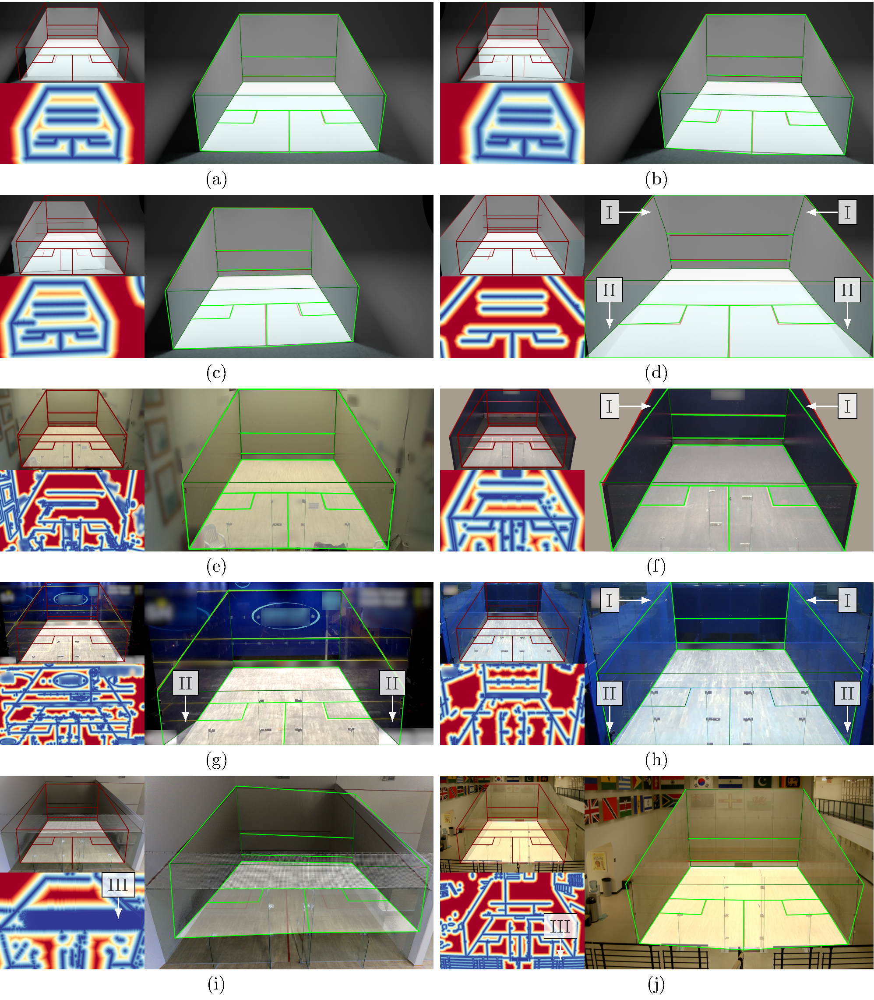

## 🎥 🧬 Evolution Resectioning

This repository contains an implementation for static camera calibration by applying a genetic algorithm.

## Features:

As a core component, a basic algorithm for applying a genetic algorithm is provided. Based on this, the actual camera resectioning algorithm is implemented: Different strategies can be combined into a strategy bundle, which is then used by the algorithm for camera resectioning / calibration. The following strategies are available:

### (A) Initialization / Population

-   BoundedUniformPopulation
-   ValueUniformPopulation

### (B) Fitness strategy

-   DistanceMap
-   DistanceMapWithPunishment

### (C) Selection strategy

-   RouletteWheel
-   Tournament
-   Random

### (D) Crossover strategy

-   SinglePoint
-   TwoPoint
-   Uniform

### (E) Mutation strategy

-   BoundedUniformMutation
-   BoundedDistributionBasedMutation

### (F) Termination strategy

-   MaxIteration
-   NoImprovement

### Citation

Please cite in your publications if it helps your research:

    TBA

### License

This program is free software: you can redistribute it and/or modify
it under the terms of the GNU General Public License as published by
the Free Software Foundation, either version 3 of the License, or
(at your option) any later version.

This program is distributed in the hope that it will be useful,
but WITHOUT ANY WARRANTY; without even the implied warranty of
MERCHANTABILITY or FITNESS FOR A PARTICULAR PURPOSE. See the
GNU General Public License for more details.

You should have received a copy of the GNU General Public License
along with this program. If not, see <https://www.gnu.org/licenses/>.
